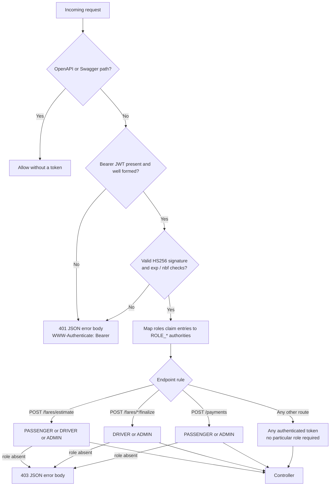
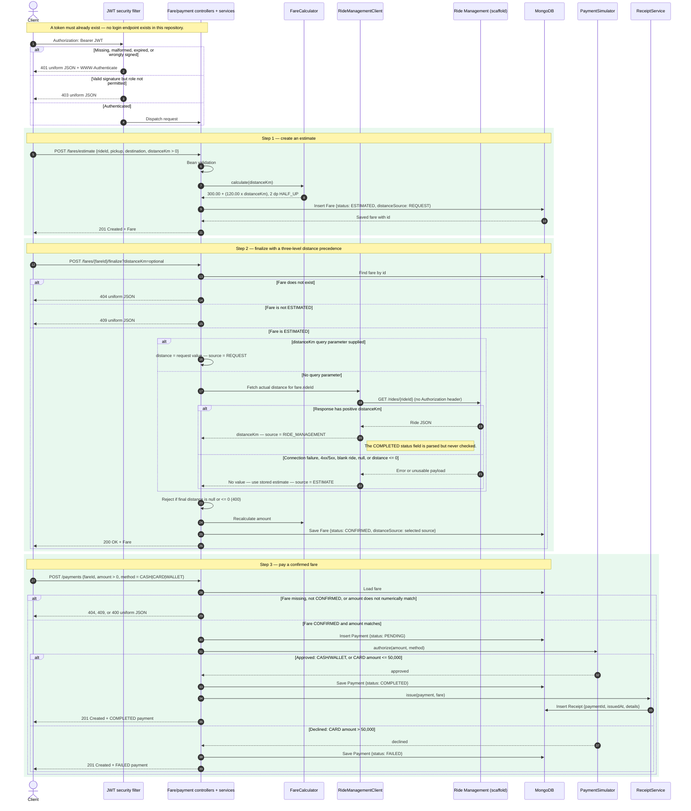
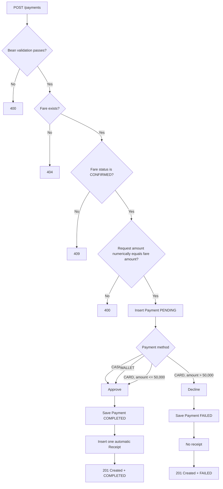
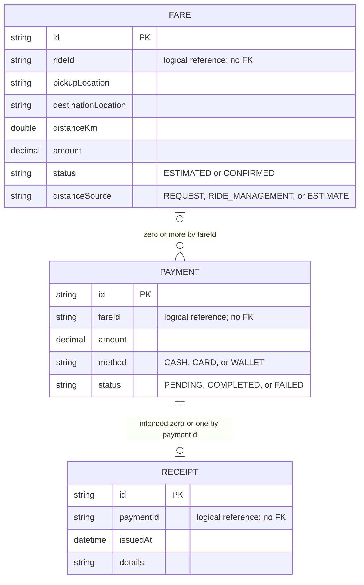
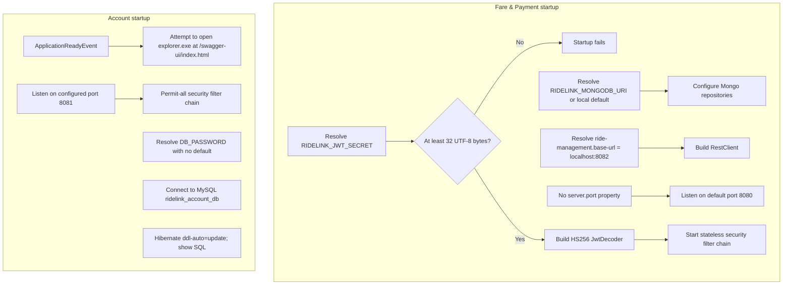

# RideLink microservices — workflow and architecture

This document is a source-verified map of the workflows that exist in this repository today. It deliberately separates **implemented behavior** from **expected behavior that is only described in comments or configuration**.

**Verified against:** the current working tree under `RideLink-Backend` on 2026-09-25.

**Scope note:** `fare-payment-service` contains the only business implementation. The account, ride-management, and driver-vehicle modules are scaffolds. Dashed edges in diagrams therefore mean *expected/configured but not implemented*.

## Files

- [Rendered master diagram (SVG)](./ridelink-microservices-workflow.svg) · [PNG](./ridelink-microservices-workflow.png)
- [Editable master Mermaid source](./ridelink-microservices-workflow.mmd)
- Detailed figures: [request admission](./figures/01-request-admission.svg) · [end-to-end sequence](./figures/02-end-to-end-sequence.svg) · [fare states](./figures/03-fare-state-machine.svg) · [fare finalization](./figures/04-fare-finalization.svg) · [payment and receipt](./figures/05-payment-receipt.svg) · [data model](./figures/06-data-model.svg) · [startup and configuration](./figures/07-startup-config.svg)

## 1. Master system workflow



| Service | Runtime and storage configuration | Implemented behavior | Cross-service behavior | Current state |
|---|---|---|---|---|
| `fare-payment-service` | Default port **8080**; MongoDB `ridelink_fare_payment_db`; HS256 JWT secret from `RIDELINK_JWT_SECRET`; ride-management base URL `http://localhost:8082` | 12 REST endpoints, fare calculation, JWT RBAC, uniform errors, payment simulation, automatic receipts, Mongo repositories | Synchronous REST call to `GET /rides/{rideId}` when finalizing without an explicit distance | **Implemented business service** |
| `account-service` | Port **8081**; MySQL `ridelink_account_db`; `DB_PASSWORD` placeholder; Hibernate `ddl-auto=update`; Swagger browser launcher | Application bootstrap, permit-all security chain, Swagger UI dependency | None | **Scaffold** — no controller, entity, repository, DTO, login, registration, or JWT issuance |
| `ride-management-service` | No runtime properties; therefore Spring default port **8080**; MySQL driver declared but no JPA starter or datasource | Application bootstrap only | The expected `GET /rides/{rideId}` contract is referenced by the fare service but is absent | **Scaffold** — expected port 8082 is not configured |
| `driver-vehicle-service` | No runtime properties; default port **8080**; JPA and MySQL dependencies declared | Application bootstrap only | None | **Scaffold** |

## 2. Request admission and authentication



Important token facts:

- The token contract documented by the fare service is HS256 with `sub`, `roles`, `iat`, and `exp` claims. No issuer or audience validation is configured.
- `RIDELINK_JWT_SECRET` is mandatory at startup and must contain at least 32 UTF-8 bytes; a missing or short value fails bean creation.
- Sessions and CSRF protection are disabled. The service is stateless.
- A valid token with no `roles` claim can read every business endpoint, because all reads fall through to `anyRequest().authenticated()`.
- The other three modules do not participate in this flow: the account service permits all requests, while ride-management and driver-vehicle have no endpoints.

## 3. Implemented end-to-end workflow



## 4. Fare lifecycle and finalization decisions

```mermaid
stateDiagram-v2
    [*] --> ESTIMATED: POST /fares/estimate succeeds
    ESTIMATED --> ESTIMATED: request rejected; document unchanged
    ESTIMATED --> CONFIRMED: finalize with distance > 0
    CONFIRMED --> CONFIRMED: finalize again; 409 Conflict
    CONFIRMED --> [*]: payment completed; no further fare transition
```

```mermaid
flowchart TD
    A["POST /fares/&#123;id&#125;/finalize"] --> B{Fare exists?}
    B -- No --> B1[404 ResourceNotFoundException]
    B -- Yes --> C{Status is ESTIMATED?}
    C -- No --> C1[409 ConflictException<br/>already finalized]
    C -- Yes --> D{distanceKm query param present?}
    D -- Yes --> E[Use request value<br/>distanceSource = REQUEST]
    D -- No --> F["Call GET /rides/&#123;rideId&#125;"]
    F --> G{Positive distanceKm received?}
    G -- Yes --> H[Use ride value<br/>distanceSource = RIDE_MANAGEMENT]
    G -- No --> I[Use stored estimate<br/>distanceSource = ESTIMATE]
    E --> J{Selected distance > 0?}
    H --> J
    I --> J
    J -- No --> J1[400 ValidationException]
    J -- Yes --> K[Recalculate 300 + 120 x km]
    K --> L[Set status CONFIRMED and save]
    L --> M[200 OK + Fare]
```





The ride-management call is intentionally best-effort: connection errors and HTTP error responses are caught and logged, then the estimated distance is used. There is no circuit breaker, retry, or explicitly configured connect/read timeout in the client.

## 5. Payment and receipt workflow



Receipt behavior that is intentional in the current design:

- There is no `POST /receipts` endpoint; receipts can only be issued by an approved payment.
- The receipt stores a human-readable snapshot: ride, pickup, destination, method, and amount.
- A declined payment is **not** an HTTP error. The endpoint still returns `201 Created` with a `FAILED` payment.
- `GET /receipts/payment/{paymentId}` returns `404` when the payment has no receipt, including the declined-payment case.
- The repository declares `findAllByOrderByIssuedAtDesc()`, but `GET /receipts` calls `findAll()`; list receipts are therefore not sorted by the declared helper.

## 6. Complete API surface

| Method and path | Admission | Success | Implementation and notable behavior |
|---|---|---|---|
| `POST /fares/estimate` | `PASSENGER`, `DRIVER`, `ADMIN` | `201` Fare | Requires nonblank `rideId`, `pickupLocation`, `destinationLocation`; requires `distanceKm > 0`. Amount is always server-calculated. Stores `ESTIMATED` and `distanceSource=REQUEST`. |
| `POST /fares/{id}/finalize?distanceKm=` | `DRIVER`, `ADMIN` | `200` Fare | Applies the documented distance precedence. `404` if missing, `409` if already finalized, `400` if no positive distance is available or the query parameter is not numeric. |
| `GET /fares/{id}` | Any valid token | `200` Fare | `404` if absent. |
| `GET /fares/ride/{rideId}` | Any valid token | `200` Fare[] | Documented as a service-to-service read for ride-management; returns `[]` when there are no fares. It does not check whether the ride exists, and no caller currently exists. |
| `GET /fares` | Any valid token | `200` Fare[] | Unfiltered, unpaginated list. |
| `POST /payments` | `PASSENGER`, `ADMIN` | `201` Payment | Requires nonblank `fareId`, `amount > 0`, and case-insensitive `CASH`, `CARD`, or `WALLET`. Requires a `CONFIRMED` fare and an exact numeric amount match. |
| `GET /payments/{id}` | Any valid token | `200` Payment | `404` if absent. |
| `GET /payments/fare/{fareId}` | Any valid token | `200` Payment[] | Returns `[]` when there are no payments; no fare existence check is performed. |
| `GET /payments` | Any valid token | `200` Payment[] | Unfiltered, unpaginated list. |
| `GET /receipts` | Any valid token | `200` Receipt[] | Uses unsorted `findAll()`. |
| `GET /receipts/{id}` | Any valid token | `200` Receipt | `404` if absent. |
| `GET /receipts/payment/{paymentId}` | Any valid token | `200` Receipt | `404` if the payment id has no receipt. No payment existence check is performed. |
| `/v3/api-docs/**`, `/swagger-ui.html`, `/swagger-ui/**` | Public | Documentation | The security filter explicitly permits these paths. |

Not exposed over HTTP:

- `FareService.update(...)` and `delete(...)` exist but have no controller mapping.
- `PaymentService.update(...)` and `delete(...)` exist but have no controller mapping.
- `ReceiptService.update(...)` and `delete(...)` exist but have no controller mapping.
- There are no update, delete, refund, cancel, or receipt-creation endpoints.

## 7. Persistence and logical data relationships



Data rules and constraints:

- MongoDB database: `ridelink_fare_payment_db`; collections: `fares`, `payments`, `receipts`.
- All identifiers are string Mongo ids and all cross-document relationships are plain string fields.
- No foreign keys, unique indexes, compound indexes, or referential constraints are declared.
- One ride can have multiple fares; one fare can have multiple payments.
- Nothing prevents duplicate successful payments for the same fare.
- `findByPaymentId` returns `Optional<Receipt>` although no unique constraint guarantees at most one receipt. If duplicates exist, the single-result query can raise a Spring Data result-size exception that surfaces as `500`.
- `PENDING` is persisted before gateway authorization, and the later status update plus receipt insert are separate writes; there is no enclosing transaction. A process failure between those writes can leave a stored `PENDING` payment.
- Mongo write failures are not mapped to a domain-specific status, so they fall through to the generic `500` handler.

## 8. Error and degradation paths

Every implemented error response uses the same shape:

```json
{
  "timestamp": "...",
  "status": 400,
  "error": "Bad Request",
  "message": "human-readable reason",
  "path": "/example"
}
```

| Status | Trigger | Where it is produced |
|---|---|---|
| `400` | Bean validation, malformed JSON, invalid query-parameter type, nonpositive final distance, or payment amount mismatch | `GlobalExceptionHandler` |
| `401` | Missing, malformed, expired, or wrongly signed Bearer token | `SecurityErrorHandlers`, before controller dispatch; includes `WWW-Authenticate: Bearer` |
| `403` | Valid token without a role allowed for the operation | `SecurityErrorHandlers`, before controller dispatch |
| `404` | Fare, payment, or receipt missing; or authenticated request to an unknown path | `GlobalExceptionHandler` |
| `405` | Known path with an unsupported HTTP method | `GlobalExceptionHandler` |
| `415` | Unsupported request content type | `GlobalExceptionHandler` |
| `500` | Any unhandled exception, including persistence failures; details are logged, not returned | `GlobalExceptionHandler` |

Special degradation behavior:

- A ride-management outage does **not** fail the finalization request. It silently downgrades the distance source to `ESTIMATE` after a warning log.
- A `404` from ride-management is treated the same as an outage and falls back.
- A positive `distanceKm` is accepted even when the ride payload's `status` is not `COMPLETED`.
- If the explicit `distanceKm` parameter is supplied, ride-management is not called at all.
- A declined simulated card payment is a successful HTTP request (`201`) with business status `FAILED`; there is no `402` response.
- If receipt insertion fails after a payment was marked `COMPLETED`, the request fails while the completed payment can remain stored.

## 9. Startup and configuration workflow



Test behavior: every module has only a `contextLoads()` test. The fare test injects a random secret through `@DynamicPropertySource`, so the test does not prove any endpoint, security rule, calculation, fallback, or persistence behavior.

## 10. Integration gaps that the diagram exposes

### Blocking the intended end-to-end journey

1. **No token issuer:** the fare service expects account-service JWTs, but account-service has no login, user, or token code.
2. **No ride endpoint:** the fare client calls `GET /rides/{rideId}`, but ride-management has no controller.
3. **Port mismatch:** the caller uses `http://localhost:8082`; ride-management does not set `server.port`, so it defaults to `8080`.
4. **Port collision:** fare-payment and driver-vehicle also default to `8080` unless overridden externally.
5. **No service-to-service authentication:** the ride lookup sends no bearer token. A secured ride endpoint would answer `401`, which the client would swallow and downgrade to the estimate.
6. **No ride validation on estimate:** `rideId` is only a nonblank string; the estimate is not checked against ride-management.
7. **Incomplete MySQL setup:** account has a datasource but no domain model; ride and driver have driver dependencies without usable datasource configuration.

### Consistency, authorization, and operational gaps

8. No idempotency key: retrying `POST /payments` can create duplicate payments and receipts.
9. No database uniqueness on `receipts.paymentId`; the single-receipt lookup is only an application assumption.
10. No transaction spans the PENDING, COMPLETED/FAILED, and receipt writes.
11. No optimistic locking on fares, so two concurrent finalize requests can both pass the `ESTIMATED` check.
12. Role checks are not ownership checks: any authorized role can read every fare, payment, and receipt, and a driver can finalize any fare id.
13. The JWT decoder validates signature and timestamps but not `iss` or `aud`.
14. No CORS configuration, pagination, rate limiting, actuator endpoints, tracing, or metrics are present.
15. No explicit client timeouts, retry policy, or circuit breaker exist for the ride-management call.
16. No message broker, event publication, domain events, webhooks, or notifications exist; the payment simulator is in-process only.
17. No container, compose, Kubernetes, aggregator POM, or service-discovery configuration exists.

## 11. Source map

| Area | Source evidence |
|---|---|
| Fare runtime config and cross-service URL | `fare-payment-service/src/main/resources/application.properties:1` |
| JWT token contract, RBAC, decoder, role mapping | `fare-payment-service/src/main/java/com/ridelink/fare_payment_service/config/SecurityConfig.java:20` |
| Uniform 401/403 responses | `fare-payment-service/src/main/java/com/ridelink/fare_payment_service/config/SecurityErrorHandlers.java:16` |
| Fare endpoints | `fare-payment-service/src/main/java/com/ridelink/fare_payment_service/controller/FareController.java:21` |
| Payment endpoints | `fare-payment-service/src/main/java/com/ridelink/fare_payment_service/controller/PaymentController.java:20` |
| Receipt endpoints and no-create policy | `fare-payment-service/src/main/java/com/ridelink/fare_payment_service/controller/ReceiptController.java:15` |
| Estimate/finalize rules | `fare-payment-service/src/main/java/com/ridelink/fare_payment_service/service/FareService.java:29` |
| Fare formula | `fare-payment-service/src/main/java/com/ridelink/fare_payment_service/service/FareCalculator.java:8` |
| Payment lifecycle and receipt trigger | `fare-payment-service/src/main/java/com/ridelink/fare_payment_service/service/PaymentService.java:31` |
| Simulated gateway rules | `fare-payment-service/src/main/java/com/ridelink/fare_payment_service/service/PaymentSimulator.java:7` |
| Automatic receipt creation | `fare-payment-service/src/main/java/com/ridelink/fare_payment_service/service/ReceiptService.java:22` |
| Ride-management client, expected contract, fallback | `fare-payment-service/src/main/java/com/ridelink/fare_payment_service/client/RideManagementClient.java:12` |
| Validation contracts | `fare-payment-service/src/main/java/com/ridelink/fare_payment_service/dto/FareEstimateRequest.java:7`, `PaymentRequest.java:10` |
| Mongo documents and statuses | `fare-payment-service/src/main/java/com/ridelink/fare_payment_service/entity/Fare.java:8`, `Payment.java:8`, `Receipt.java:8` |
| Mongo repository methods | `fare-payment-service/src/main/java/com/ridelink/fare_payment_service/repository/FareRepository.java:8`, `PaymentRepository.java:8`, `ReceiptRepository.java:9` |
| Uniform error mapping | `fare-payment-service/src/main/java/com/ridelink/fare_payment_service/exception/GlobalExceptionHandler.java:21` |
| Account port, datasource, JPA | `account-service/src/main/resources/application.properties:1` |
| Account permit-all chain | `account-service/src/main/java/com/ridelink/account_service/config/SecurityConfig.java:8` |
| Account Swagger auto-launch | `account-service/src/main/java/com/ridelink/account_service/config/SwaggerBrowserLauncher.java:9` |
| Empty ride-management runtime | `ride-management-service/src/main/resources/application.properties:1` and `ride-management-service/src/main/java/com/ridelink/ride_management_service/RideManagementServiceApplication.java:1` |
| Empty driver-vehicle runtime | `driver-vehicle-service/src/main/resources/application.properties:1` and `driver-vehicle-service/src/main/java/com/ridelink/driver_vehicle_service/DriverVehicleServiceApplication.java:1` |
